# Django-Blog
This is a web application that allows users to register a profile and to create, modify and delete posts.
In the even that a user forgets his/her password they can obtain a new one using their email address.

The following are images of the templates of the Web applications.

The home page:
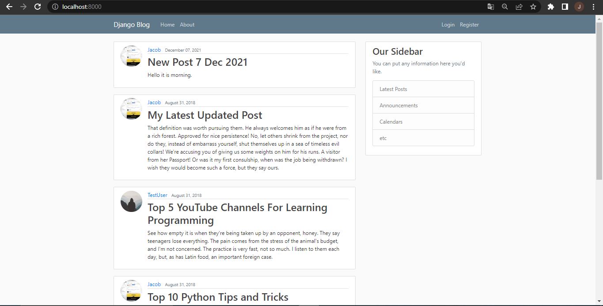

Login page:
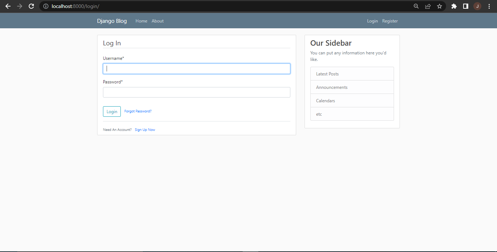

Register page:
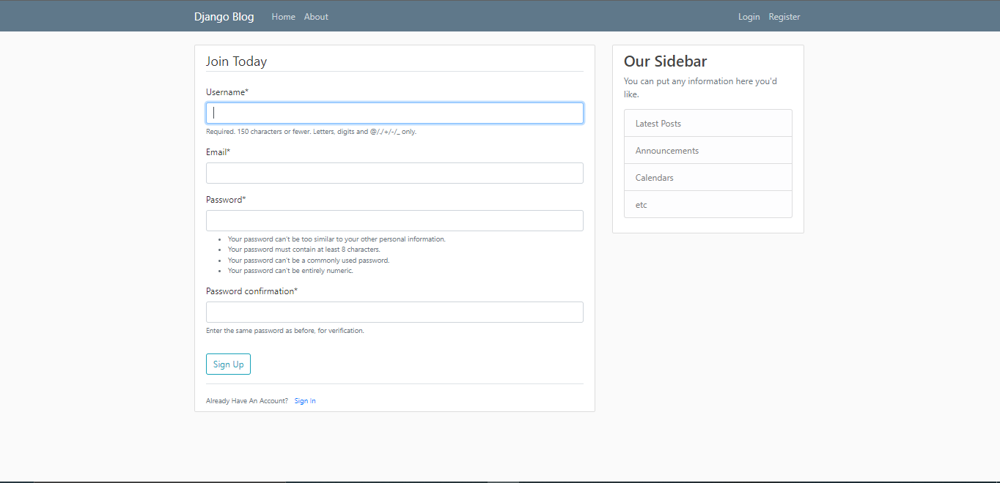
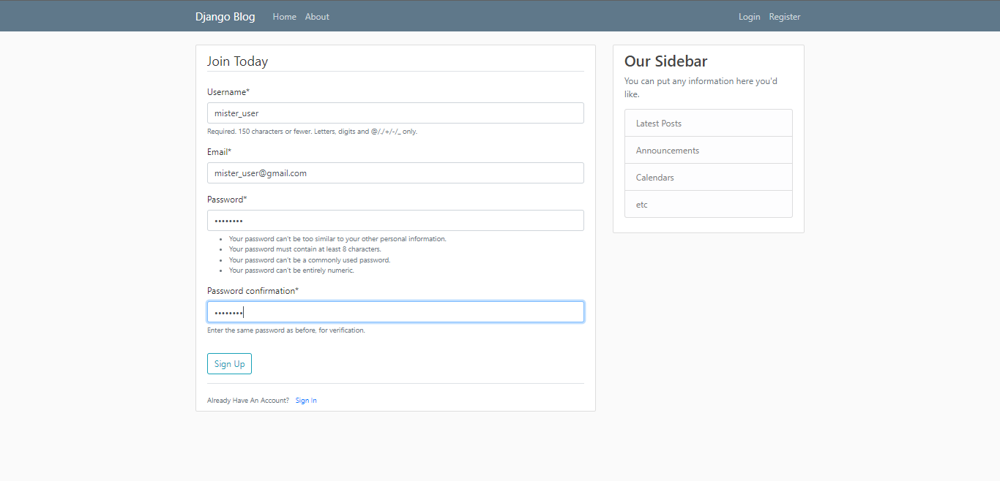

Profile:
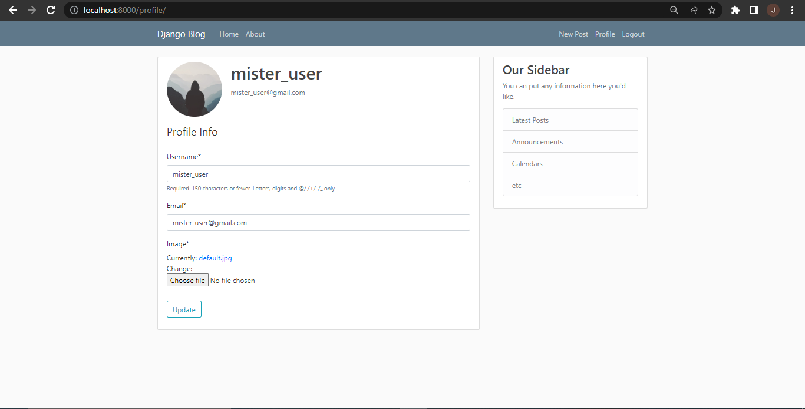

Posting:
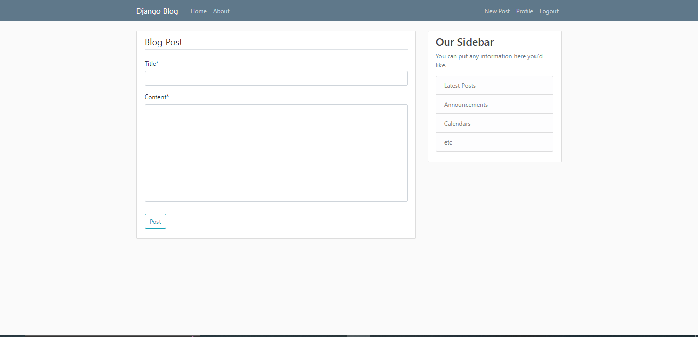
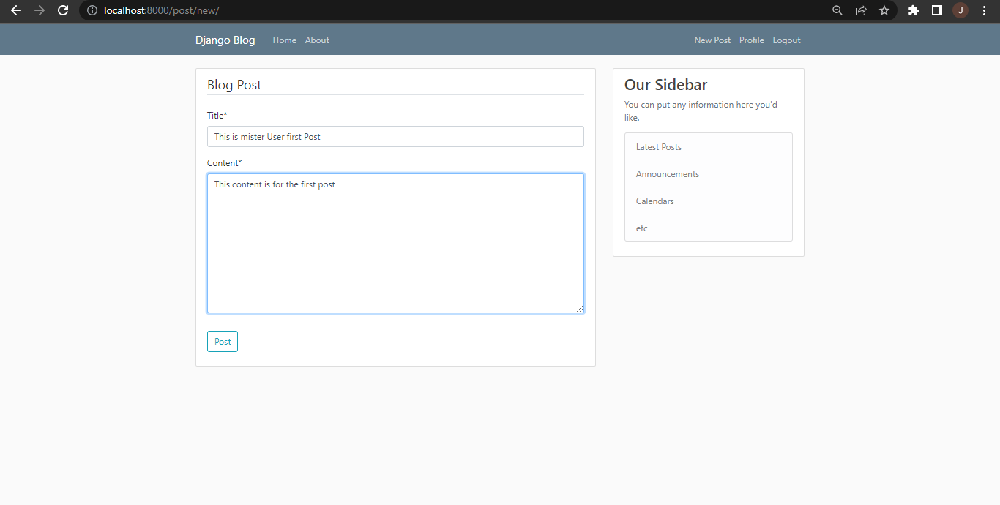
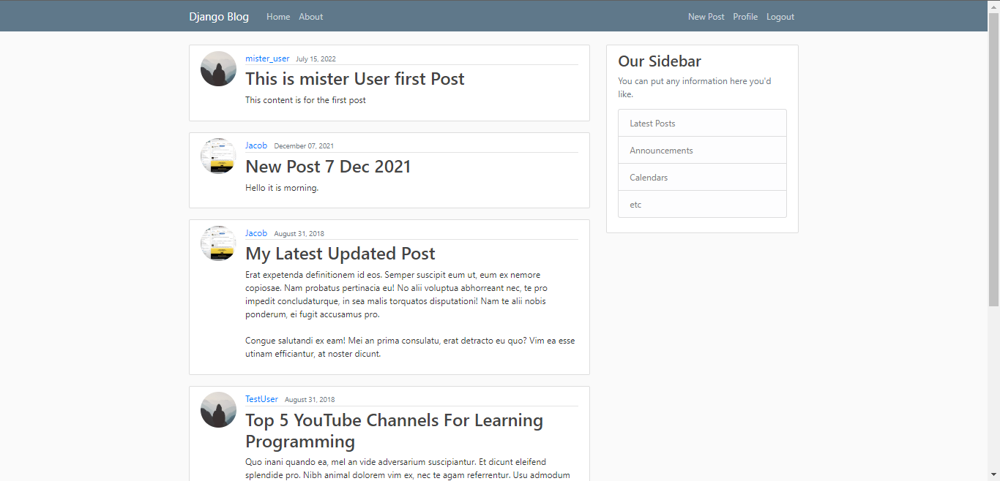

Logout Page:
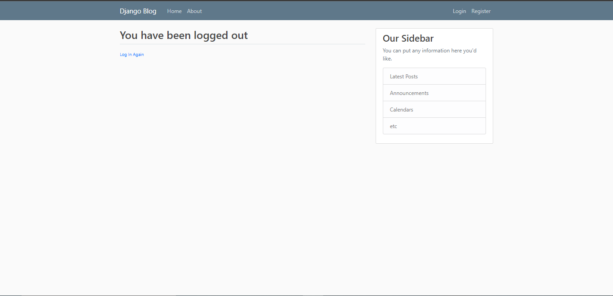

Forgot Password:
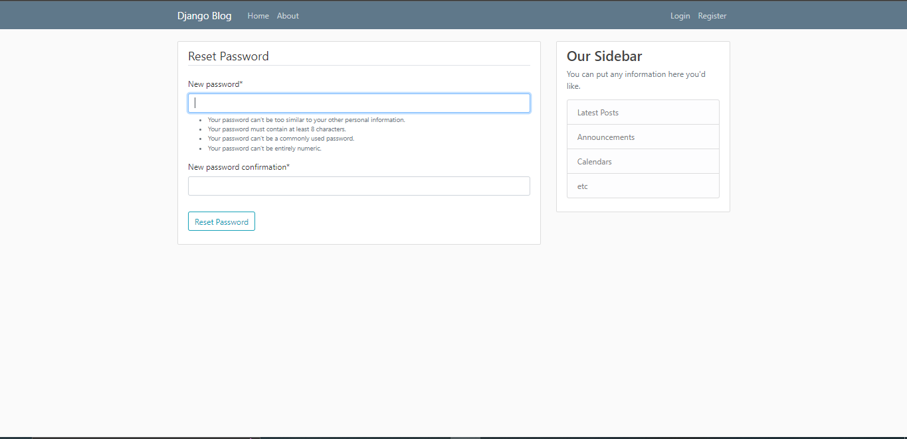
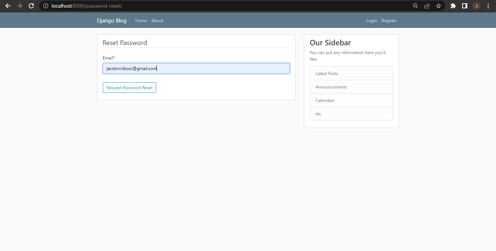
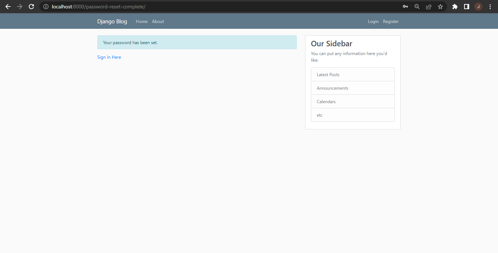
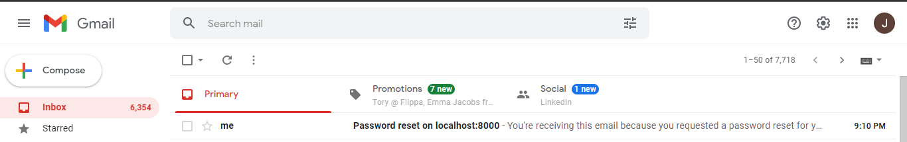
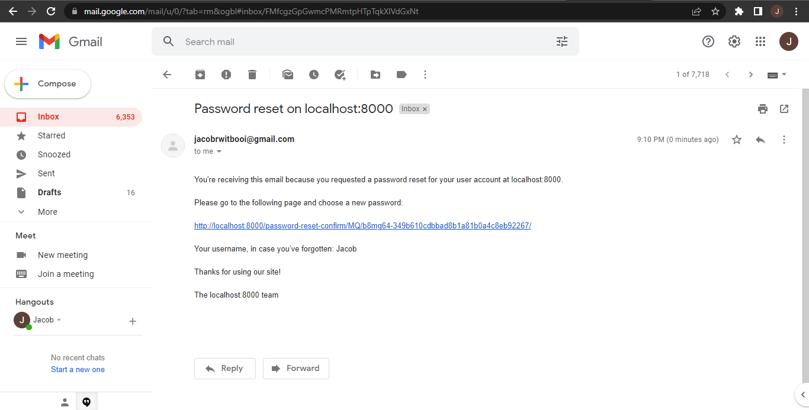

